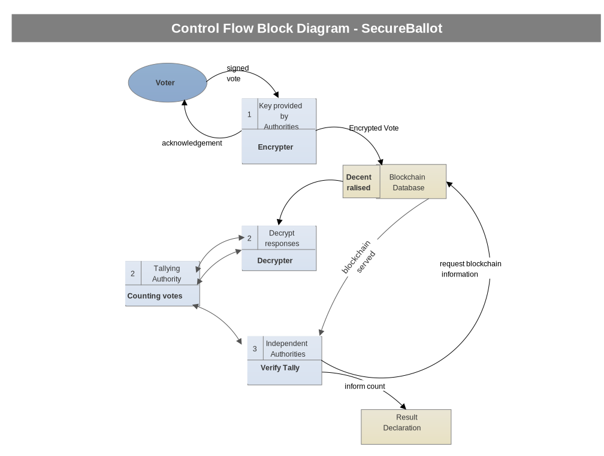

# SecureBallot
This contains the code of the prototype web app built using solidity, web3(for Ethereum).

### The Aim of the Project
We intend to build an web app for online voting which is transparent and cannot be tampered with.

### Why Ethereum
Ethereum is a platform for Smart Contracts. It provides channel decentralised communication for the successful creation of the web app. 

### How it will work
- Every voter has been given a secret that authenticates him. This could be something as trivial as OTP verification. In the best case it could be some biometric authentication such as fingerprint or ratina matching.
- Now the voter authenticates himself during the election time duration. He gets to see a simple UI just as an electronic voting machine (EVM) where the candidates are listed along with their election symbols and party names.
- The underlying blockchain based system is abstracted from the user. The user votes for his preferred candidate and exits.
- The vote gets recorded but the identity of the voter is kept anonymous.
- Each user will have sufficient ETH (Ethereum currency) to vote exactly once but not more. So duplicate votes will be prevented.
- The votes cannot be altered because there is no cetralised server. Rather for each vote one transaction gets recorded in the blockchain which is immutable.
- Any hacking attempt on the blockchain will be detected since it changes the hashes for the individual transactions. So there will be complete transparency. 

### Alternative to EVMs

It is proposed that this blockchain based systems can be used to replace conventional EVMs(Electronic Voting Machines). Now In every polling booth there can be systems with this dApp (distributed app). In that case it will not be ncessary for the voters to have ethers (crypto curency) individually in order to be able to cast their votes. So the problem of distributing ethers is eliminated. Now there will be only immutable transactions in the blockchain for each vote cast.

### A simplified Block Diagram

